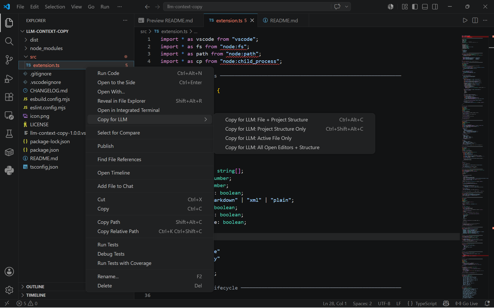
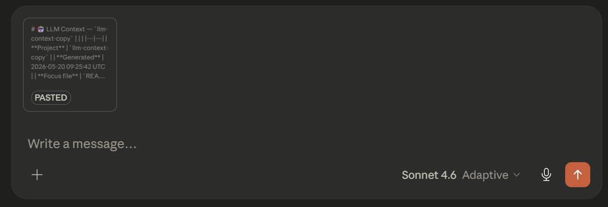
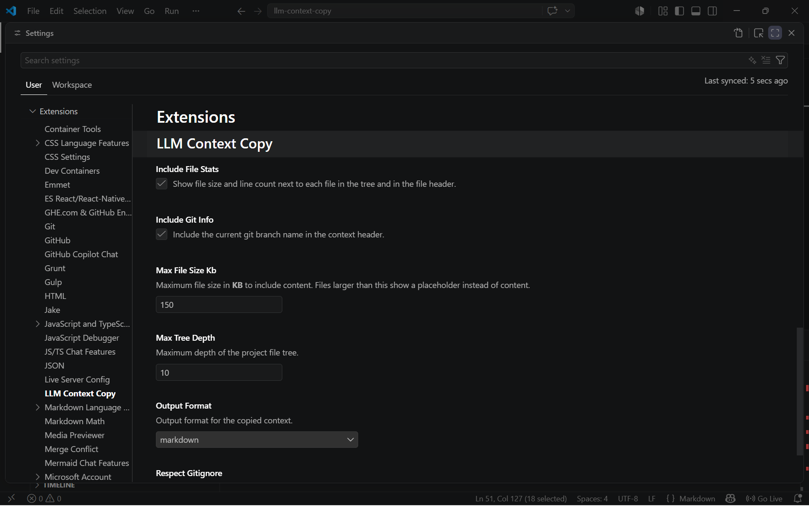

<div align="center">

# 🤖 LLM Context Copy

### One right-click. Your entire codebase context — ready for any AI.

**[Install from Marketplace](https://marketplace.visualstudio.com/items?itemName=AayushNayakJain.llm-context-copier) · [Report Bug](https://github.com/Aayush-Nayak-Jain/LLM-Context-Copier/issues) · [Request Feature](https://github.com/Aayush-Nayak-Jain/LLM-Context-Copier/issues)**

</div>

---

## 📖 What is this?

When working with AI assistants like Claude, ChatGPT, or Gemini, you often need to share:
- The **content of a specific file** you want help with
- The **overall structure of your project** so the AI understands the context

Without this extension, you'd manually open a file, copy its content, then separately describe your folder layout. That's slow, error-prone, and the AI still lacks full context.

**LLM Context Copy** solves this in a single right-click. It scans your project, builds an optimized tree of your file structure, appends the content of your chosen file, and puts everything on your clipboard — formatted perfectly for LLMs.

---

## 📸 Screenshots

### Right-click any file in the Explorer
> The **Copy for LLM** submenu appears on every file and folder — choose your mode.



---

### Clean, structured output — ready to paste
> The copied context includes a metadata header, a full annotated project tree with the focus file marked, and the complete file content with language hints.



---

### Token estimate notification
> Every copy shows you exactly how much context you're sending — so you never accidentally exceed a model's context window.


---

### Fully configurable via Settings
> Customize exclusions, output format, file size limits, tree depth — everything is exposed in VS Code's native Settings UI.



---

## ✨ Features

| Feature | Description |
|---------|-------------|
| **📋 File + Structure** | Copies the active file's full content alongside the complete project tree |
| **📁 Structure Only** | Copies only the project tree — ideal for architecture and design discussions |
| **📄 File Only** | Copies a single file with its language tag and file stats |
| **📦 Open Editors** | Copies all currently open editor tabs together with the project tree |
| **🔒 Smart exclusion** | Auto-ignores `node_modules`, `.git`, `dist`, build outputs, lockfiles, and binary files |
| **🗂️ .gitignore aware** | Reads your `.gitignore` and respects your existing exclusion rules |
| **📊 Token estimate** | Shows estimated token count, line count, and file size after every copy |
| **🌳 Annotated tree** | Focus file is marked with `◄ FOCUS` in the tree so the AI knows exactly what to look at |
| **🎛️ 3 output formats** | Markdown (default), XML, or Plain Text — choose what works best for your LLM workflow |
| **⚙️ Fully configurable** | Every behaviour is adjustable through VS Code's native Settings UI |

---

## 🛠️ Tech Stack

This is a native VS Code extension. No external services, no internet calls, no runtime dependencies.

| Layer | Technology | Purpose |
|-------|-----------|---------|
| **Language** | TypeScript 5.8 | Strict, typed extension code |
| **Runtime** | Node.js 18+ (built-in to VS Code) | File system access, git detection, clipboard |
| **VS Code API** | `vscode ^1.90.0` | Commands, menus, settings, notifications |
| **Bundler** | esbuild 0.28 | Compiles `src/extension.ts` → single `dist/extension.js` (9 KB) |
| **Linter** | ESLint 9 + TypeScript-ESLint 8 | Flat config format, strict type-aware rules |
| **Packager** | @vscode/vsce 3.x | Produces `.vsix` and publishes to Marketplace |
| **Node APIs used** | `node:fs`, `node:path`, `node:child_process` | Tree building, file reading, git branch detection |

There are **zero runtime `node_modules`** — everything is bundled into a single 9 KB file.

---

## 📦 Installation

### Method 1 — VS Code Marketplace (recommended)

**Option A — Install button in VS Code:**
1. Open VS Code
2. Press `Ctrl+Shift+X` (or `Cmd+Shift+X` on Mac) to open the Extensions panel
3. Search for **LLM Context Copy**
4. Click **Install**

**Option B — Install from browser:**
1. Go to the [Marketplace page](https://marketplace.visualstudio.com/items?itemName=AayushNayakJain.llm-context-copier)
2. Click the green **Install** button
3. Allow the browser to open VS Code when prompted
4. Click **Install** in the VS Code dialog that appears

---

### Method 2 — Install from `.vsix` (offline / pre-release)

Use this if you downloaded a `.vsix` file directly from the [Releases page](https://github.com/Aayush-Nayak-Jain/LLM-Context-Copier/releases).

**Via terminal:**
```bash
code --install-extension llm-context-copy-1.0.0.vsix
```

**Via VS Code UI:**
1. Open the Extensions panel (`Ctrl+Shift+X`)
2. Click the `···` menu at the top right of the panel
3. Select **Install from VSIX...**
4. Browse to and select the `.vsix` file

---

### Method 3 — Build from source

Use this if you want to modify the extension or contribute to it.

```bash
# 1. Clone the repository
git clone https://github.com/your-username/llm-context-copy
cd llm-context-copy

# 2. Install dev dependencies
npm install

# 3. Build the extension bundle
npm run bundle

# 4. Package into a .vsix file
npm run package

# 5. Install it
code --install-extension llm-context-copy-1.0.0.vsix
```

For live development with auto-rebuild:
```bash
npm run bundle:watch
# Then press F5 in VS Code to launch the Extension Development Host
```

---

## 🚀 How to Use

### Step 1 — Open a project in VS Code

Open any folder or workspace. The extension works with any language or framework.

### Step 2 — Right-click a file

In the **Explorer panel** (left sidebar) or in the **editor tab**, right-click the file you want to focus on. You'll see the **Copy for LLM** submenu.

### Step 3 — Choose a copy mode

| Mode | Best used when... |
|------|------------------|
| **📋 File + Project Structure** | You want help with a specific file and need the AI to understand the project around it. This is the most common option. |
| **📁 Project Structure Only** | You want to discuss architecture, folder layout, or ask "where should I put this?" |
| **📄 Active File Only** | You just want to paste a single file — no tree needed. |
| **📦 All Open Editors + Structure** | You're working across multiple files and want the AI to see all of them at once. |

### Step 4 — Paste into your LLM

Go to Claude, ChatGPT, Gemini, or any AI — paste with `Ctrl+V`. The output arrives pre-formatted with:
- A metadata header showing project name, timestamp, git branch, and focus file
- A full annotated file tree with your focus file marked as `◄ FOCUS`
- The complete file content in a fenced code block with the correct language tag

### Keyboard shortcuts

| Shortcut | Action |
|----------|--------|
| `Ctrl+Alt+C` / `Cmd+Alt+C` | Copy file + project structure |
| `Ctrl+Alt+Shift+C` / `Cmd+Alt+Shift+C` | Copy structure only |

### Command Palette

Press `Ctrl+Shift+P` → type **LLM Context** → all four commands appear.

---

## 📤 Example Output

Here's exactly what gets copied when you use **File + Structure** (Markdown format):

```
# 🤖 LLM Context — `my-api`

| | |
|---|---|
| **Project** | `my-api` |
| **Generated** | 2025-06-01 14:23:11 UTC |
| **Branch** | `feature/auth` |
| **Focus file** | `src/auth/login.service.ts` |

---

## 📁 Project Structure

my-api/
├── 📁 src/
│   ├── 📁 auth/
│   │   ├── 🔷 login.service.ts (4.2 KB)  ◄ FOCUS
│   │   └── 🔷 auth.module.ts (1.1 KB)
│   ├── 📁 users/
│   │   └── 🔷 users.service.ts (3.8 KB)
│   └── 🔷 main.ts (0.5 KB)
├── 📋 package.json (1.2 KB)
└── 📝 README.md (2.0 KB)

## 📄 `src/auth/login.service.ts` · 112 lines · 4.2 KB

```typescript
import { Injectable } from '@nestjs/common';
// ... full file content ...
```

---
*Context built by LLM Context Copy (VS Code extension)*
```

---

## ⚙️ Configuration

Open Settings with `Ctrl+,` and search for **LLM Context Copy** to see all options:

| Setting | Type | Default | Description |
|---------|------|---------|-------------|
| `excludePatterns` | `string[]` | `["node_modules", ".git", "dist", ...]` | File/folder names and glob patterns to hide from the tree |
| `maxFileSizeKb` | `number` | `150` | Files larger than this (in KB) show a placeholder instead of their content |
| `maxTreeDepth` | `number` | `10` | How many folder levels deep the tree goes |
| `includeFileStats` | `boolean` | `true` | Show file size and line count in the tree and file header |
| `outputFormat` | `string` | `"markdown"` | Output format: `"markdown"` \| `"xml"` \| `"plain"` |
| `includeGitInfo` | `boolean` | `true` | Include current git branch name in the context header |
| `respectGitignore` | `boolean` | `true` | Parse `.gitignore` and exclude matching paths from the tree |
| `showTokenEstimate` | `boolean` | `true` | Show a notification with token count after every copy |

### Tip — XML format for Claude system prompts

If you use Claude's system prompt or API, switch the output format to XML:

```jsonc
// settings.json
{
  "llmContextCopy.outputFormat": "xml"
}
```

The output will use `<llm-context>`, `<project-structure>`, and `<file>` tags — ideal for structured prompt engineering.

---

## 💡 Prompting tips

After pasting your context, these prompts tend to work well:

- *"I'm getting a NullPointerException in the focus file. Here's the full project context:"*
- *"Refactor the focus file to match the patterns you see in the rest of this project"*
- *"Write unit tests for the focus file. Follow the conventions you see in the project structure"*
- *"Based on the project structure, where should I add a new service for X?"*
- *"Find any bugs or security issues in the focus file, given this project context"*

---

## 🔒 Privacy

LLM Context Copy is **100% local**. It:
- Reads files from your workspace on your machine
- Writes only to your system clipboard
- Makes no network requests
- Sends no telemetry
- Has no runtime dependencies or external services

Your code never leaves your machine until you paste it yourself.

---

## 🤝 Contributing

1. Fork the repository
2. Create a feature branch: `git checkout -b feature/my-feature`
3. Make your changes in `src/extension.ts`
4. Run `npm run bundle` to rebuild
5. Press `F5` in VS Code to test in the Extension Development Host
6. Submit a pull request

---

## 📄 License

MIT © Aayush Nayak Jain